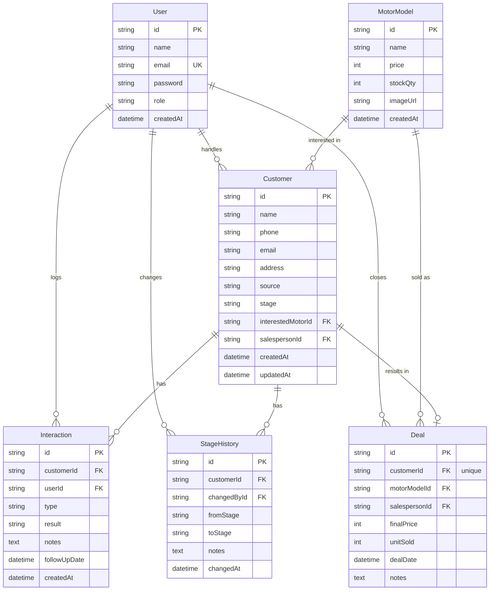

# Entity Relationship Diagram

```mermaid
erDiagram
    User ||--o{ Customer : "handles"
    User ||--o{ Interaction : "logs"
    User ||--o{ StageHistory : "changes"
    User ||--o{ Deal : "closes"
    MotorModel ||--o{ Customer : "interested in"
    MotorModel ||--o{ Deal : "sold as"
    Customer ||--o{ Interaction : "has"
    Customer ||--o{ StageHistory : "has"
    Customer ||--o| Deal : "results in"

    User {
        string id PK
        string name
        string email UK
        string password
        string role
        datetime createdAt
    }

    MotorModel {
        string id PK
        string name
        int price
        int stockQty
        string imageUrl
        datetime createdAt
    }

    Customer {
        string id PK
        string name
        string phone
        string email
        string address
        string source
        string stage
        string interestedMotorId FK
        string salespersonId FK
        datetime createdAt
        datetime updatedAt
    }

    Interaction {
        string id PK
        string customerId FK
        string userId FK
        string type
        string result
        text notes
        datetime followUpDate
        datetime createdAt
    }

    StageHistory {
        string id PK
        string customerId FK
        string changedById FK
        string fromStage
        string toStage
        text notes
        datetime changedAt
    }

    Deal {
        string id PK
        string customerId FK "unique"
        string motorModelId FK
        string salespersonId FK
        int finalPrice
        int unitSold
        datetime dealDate
        text notes
    }
```